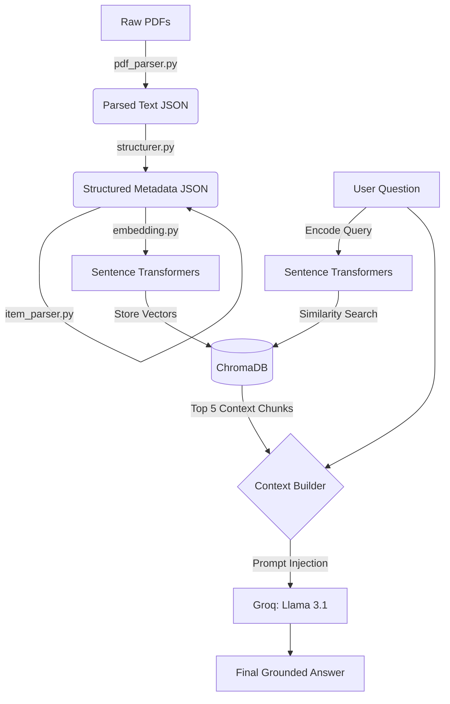

```markdown
# Hybrid Invoice RAG Chatbot 🧾🤖

A powerful, production-ready Retrieval-Augmented Generation (RAG) pipeline designed to process, structure, and accurately answer questions across hundreds of PDF invoices.

This project uses **Llama 3.1** (via Groq) as the core reasoning engine, **ChromaDB** for semantic vector storage, and **Sentence Transformers** for high-quality embeddings.

## 🚀 Features

- **Automated PDF Parsing:** Extracts semi-structured text line-by-line from hundreds of invoice PDFs.
- **Data Structuring:** Converts raw invoice text into structured JSON metadata (Vendor, Client, Totals, Individual Items, Dates).
- **Semantic Chunking & Embedding:** Intelligently embeds structural chunks into a persistent `ChromaDB` vector store using `all-MiniLM-L6-v2`.
- **High-Speed Inference:** Uses `llama-3.1-8b-instant` via the Groq API for lightning-fast answers grounded *strictly* in the provided context.

## 📁 Project Structure

```text
├── .env                        # Environment variables (Groq API Key)
├── chroma_db/                  # Persistent ChromaDB vector store
├── embeddings/
│   └── embedding.py            # Generates embeddings and stores them in ChromaDB
├── item_parserer/
│   └── item_parser.py          # Regex-based extraction for individual line items
├── main.py                     # Entry point (Handles embedding generation & Chat loop)
├── parsed/                     # JSON outputs of raw PDF text
├── parser/
│   └── pdf_parser.py           # PyPDF extraction from the `pdfs/` directory
├── pdfs/                       # Raw input PDFs go here
├── rag.py                      # Core Llama 3.1 Chatbot & Context Retrieval logic
├── structured/                 # Fully structured JSON metadata files
└── structurer/
    └── structurer.py           # Converts raw parsed text into structured metadata
```

## 🏗️ Architecture Diagram

Here is how the data flows from raw PDF to the final LLM answer:



## ⚙️ Setup & Installation

1. **Install Dependencies:**
   Ensure you have the required packages installed:
   ```bash
   pip install pypdf sentence-transformers chromadb groq python-dotenv
   ```

2. **Set up your API Key:**
   Create a `.env` file in the root directory and add your Groq API key:
   ```env
   GROQ_API_KEY=gsk_your_api_key_here
   ```

3. **Add your Data:**
   Place all your invoice PDFs into the `pdfs/` directory.

4. **Run the Application:**
   Execute the main script to build the vector database and start the chat interface:
   ```bash
   python main.py
   ```
